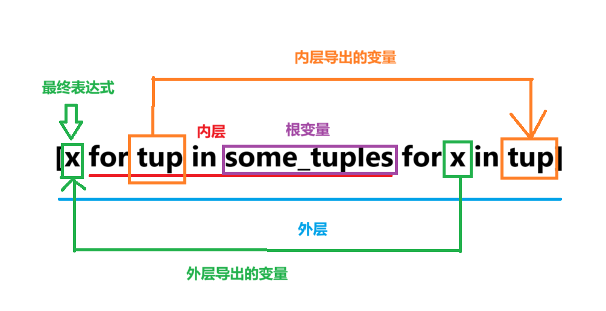

# python基础

## 数据结构

### 1.列表

**定义**: 列表是由一组有序的元素组成的集合，列表中的元素可以是任何数据类型。其列表长度可变，内容可变。  
**用法**:  

1. **创建**：  
    - list1 = [1,2,3,4,5,'aaa'] //创建一个列表  
    - list2 = list(range(1,6)) //用于处理迭代器（range）  

2. **访问**：  
    - list1[0] // 访问第一个元素 1
    - list1[-1] // 访问最后一个元素 'aaa'
    - a,b = list1[0,2] // 赋值给两个变量 a = 1, b = 2

3. **修改**：
    - list1[0] = 0 // 修改第一个元素 [0,2,3,4,5,'aaa']  
    - list1[1:3] = [0,0] // 修改第二个元素到第三个元素 [1,0,0,4,5,'aaa']  
    - list1.**append**(6) // 添加一个元素 [1,2,3,4,5,'aaa',6]
    - list1.**insert**(0,7) // 在第一个元素之前添加一个元素 [7,1,2,3,4,5,'aaa',6]

4. **删除**：
    - list1.**remove**('aaa') // 删除一个匹配的元素 [1,2,3,4,5]
    - list1.**pop**(2) // 删除指定位置元素 [1,3,4,5,'aaa']

5. **排序**：
    - list1.sort() // 升序排序(不创建新对象) [1,2,3,4,5,'aaa']
    - list1.sort(key=len) // 按长度排序 [1,2,3,4,5,'aaa']

6. **其他操作**：
    - 6 **in** list1 // 判断元素是否在列表中 true
    - 6 **not in** list1 // 判断元素是否在列表中 false
    - list1 **\*** 2 // 列表复制 [1,2,3,4,5,'aaa',1,2,3,4,5,'aaa']
    - list1 **+** list2 // 列表合并 [1,2,3,4,5,'aaa',1,2,3,4,5,6]
    - list1.extend(list2) // 列表追加 [1,2,3,4,5,'aaa',1,2,3,4,5,6]

### 2.元组

**定义**: 元组是由一组有序的元素组成的集合，元组中的元素可以是任何数据类型。其列表长度不变，内容可变。  
**用法**:  

1. **创建**：  
   - tuple1 = 1,(2,3) // 创建一个元组 (1,(2,3))
   - tuple2 = (1,2,3,4,5,'aaa') // (1,2,3,4,5,'aaa')
   - tuple3 = tuple(range(1,6)) // 用于处理迭代器（range）

2. **访问**：
   - tuple1[0] // 访问第一个元素 1
   - tuple1[-1] // 访问最后一个元素 'aaa'
   - a,b = tuple1 // 赋值给两个变量 a = 1, b = (2,3)

### 3.字典

**定义**: 字典是由一组无序的键值对组成的集合，字典中的键必须是唯一的，值可以是任何数据类型。字典的长度可变，内容可变。  
**用法**:

>所有可以被hash的python对象都可以作为键  
>如标量类型（常数，浮点，字符串），元组（内部元素不可变）  
>可以通过hash()来判断是否可以作为key  

1. **创建**：  
    - dict1 = {'name':'zhangsan','age':18,'sex':'male'} // 创建一个字典 {'name':'zhangsan','age':18,'sex':'male'}
    - dict2 = dict(name='zhangsan',age=18,sex='male')
    - dict3 = dict(zip(['name','age','sex'],['zhangsan',18,'male'])) //zip()函数将两个列表组合成一个元组，然后使用dict()函数将元组转换为字典
  
2. **访问**：
    - dict1['name'] // 访问第一个元素 'zhangsan'
    - dict1.get('name') // 访问第一个元素 'zhangsan'
    - dict1.keys() // 返回字典的键 ['name','age','sex']
    - dict1.values() // 返回字典的值 ['zhangsan',18,'male']
    - dict1.items() // 返回字典的键值对 [('name','zhangsan'),('age',18),('sex','male')]
  
3. **修改**：
    - dict1['name'] = 'lisi' // 修改元素 {'name':'lisi','age':18,'sex':'male'}
    - dict1.update({'name':'wangwu'})
    - dict1.pop('name')
  
4. **删除**：
    - dict1.clear()
  
5. **其他操作**：
    - dict1.setdefault(key,default=None) // 获取字典的值，如果key不存在，则返回default

### 4.集合

**定义**: 集合是由一组无序且不重复的元素组成的集合，集合中的元素必须是唯一的，值可以是任何数据类型。集合的长度可变，内容可变。

>集合中的元素必须是唯一的，所以不能使用重复的元素。  
>可以看为只有key的字典
>内部元素不可变

**用法**:

1. **创建**：  
    - set1 = {1,2,3,4,5,'aaa'} // 创建一个集合 {1,2,3,4,5,'aaa'}
    - set2 = set(range(1,6))

2. **访问**：
    - for循环进行遍历
    - in来判断集合中是否有该元素

3. **修改**：
    - set1.add(6) // 添加一个元素 {1,2,3,4,5,'aaa',6}
    - set1.remove(6) // 删除一个元素 {1,2,3,4,5,'aaa'}

4. **删除**：
    - set1.clear()

5. **集合运算**:
    - 交集: `set1 & set2` 或 `set1.intersection(set2)` // set1与set2中都包含的元素
    - 并集: `set1 | set2` 或 `set1.union(set2)` // 存在set1和set2中的元素
    - 差集: `set1 - set2` 或 `set1.difference(set2)` //存在set1中，但是不在set2中的元素
    - 补集: `set1 ^ set2` 或 `set1.symmetric_difference(set2)` // 只在set1或set2中，不在交集中的元素

    > 可以通过 set1 &= set2 或 set1.intersection_update(set2) 来更新 set1  
    > 可以通过 set1 |= set2 或 set1.update(set2) 来更新 set1
    > 可以通过 set1 -= set2 或 set1.difference_update(set2) 来更新 set1
    > 可以通过 set1 ^= set2 或 set1.symmetric_difference_update(set2) 来更新 set1

6. **其他操作**:
    - set1.isdisjoint(set2) // 判断两个集合是否无共同元素，返回布尔值
    - set1.issubset(set2) // 判断 set1 是否是 set2 的子集，返回布尔值
    - set1.issuperset(set2) // 判断 set1 是否是 set2 的超集，返回布尔值

## 切片

> 通过切片，我们可以做到一些有意思的操作，这是一个相当灵活的工具。

切片可以对一些有序类型的序列进行操作，如: 字符串、列表、元组。  
其操作方式为: `list[start:end:step]`  
其中需要注意的是:  
**start**可以取到  
**end**无法取到  
所以切片是[start,end)的半闭半开的形式  
**例**: [0,1,2][0:2]  可得 [0,1]  

**step** 步长,可以省略,也可以为负值,默认为1

## 列表，集合，字典推导式

> expr 表示表达式，val 表示变量，collection 表示集合，condition 表示条件

1. 列表推导式:  
   > [expr for val in collection if condition]  

   例：[x * x for x in range(1,11) if x % 2 == 0]

2. 集合推导式:  
   > {expr for val in collection if condition}  

   例：{x * x for x in range(1,11) if x % 2 == 0}

3. 字典推导式:
   > {key:expr for key,val in collection if condition}  

   例：{x:x * x for x in range(1,11) if x % 2 == 0}  

>[!WARNING]
>我还有点没理解,可能有点问题，但是先睡

1. 嵌套推导式:

> 这些推导式都是可以嵌套的，嵌套的推导式会先执行内层推导式，再执行外层推导式。
例:

```python
//扁平化推导式
some_tuples = [(1, 2, 3), (4, 5, 6), (7, 8, 9)]
flattened = [x for tup in some_tuples for x in tup]
flattened
[1, 2, 3, 4, 5, 6, 7, 8, 9]

//与for循环的顺序一致
for tup in some_tuples:
    for x in tup:
        flattened.append(x)
```



## 一些寄巧

> 其实是我也不知道塞哪的，就先记录一下。

1. 判断是否继承对应类
    isinstance(obj, classinfo)

2. 判断是这个类型的对象
    isinstance(obj, classinfo)

3. 判断是否是可迭代对象

    ```python
    def isiterable(obj):
        try:
            iter(obj)
        return True
    except TypeError: # not iterable
        return False
    ```

4. 获取对象类型的继承树

    ```python
    set = {1,2,3,'a'}
    print(type(set).mro())
    //[<class 'set'>, <class 'object'>]
    ```
