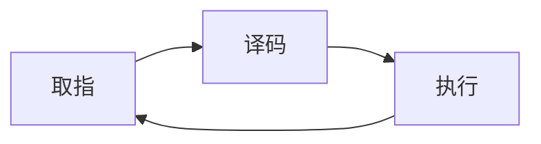

# 第二章 数据操控

## 一 计算机体系结构

### CPU构成

**算术/逻辑单元** 进行计算  
**控制单元** 操控计算机各个部件  
**寄存器单元** 包含寄存器 用于CPU内部信息的临时存储  

**寄存器**分为**通用存储器**和**专用寄存器**  

**通用存储器**一般用于存储CPU要操控的数据  
如：算数/逻辑单元 要输入输出的数据  

**专用寄存器** 分为 指令寄存器和程序计数器  
**指令寄存器**用于存储当前执行的指令
**程序计数器**用于存储下一步指令的地址

**总线**用于传输数据  

### 存储程序  

数据与程序看为同样的数据  

### 机器语言

RISC (Reduced instruction set computer)精简指令集计算机  
CISC (Complex instruction set computer)复杂指令集计算机 （变长指令）  

指令结构: 操作码 操作数

指令分为3类：
数据传输型指令  
运算逻辑型指令  
控制型指令  

### 程序执行

**机器周期**

